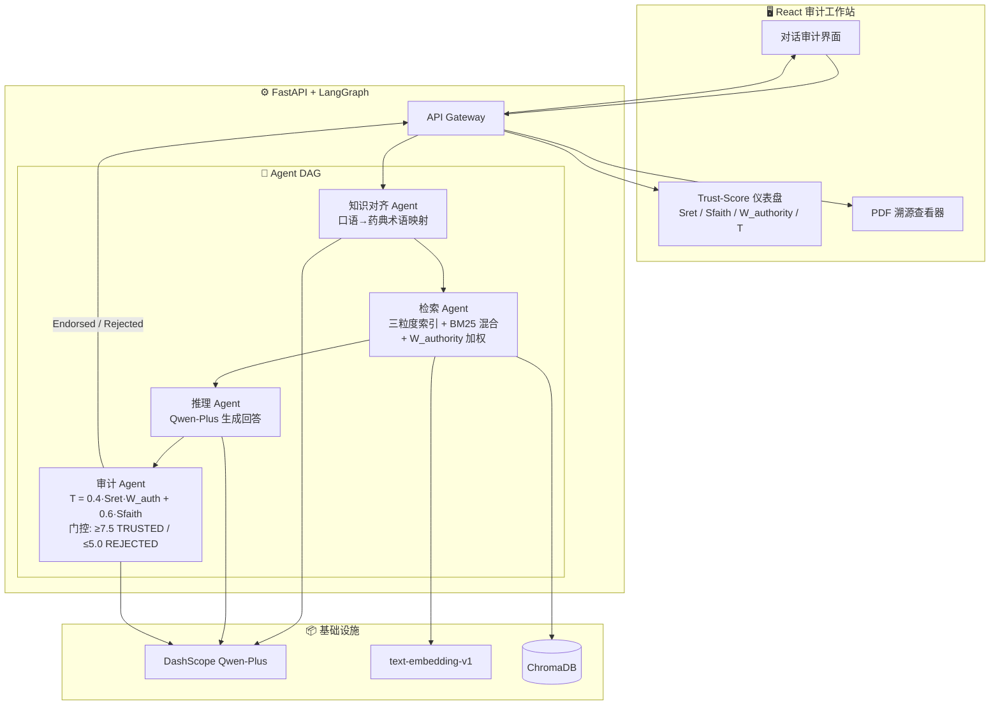

# VeriMind-Med 实施计划（v2 — 基于论文 & 现有项目分析）

## 背景：现有项目 → 新项目的关系

通过深度分析你的 [VeriMind 论文](file:///d:/Desktop/peng/study/project/VeriMind_MedAudit/VeriMind_Hallucination_RAG.pdf) 和 [GitHub 仓库](https://github.com/upstream1119/Verimind)，我们明确了：

> **VeriMind-Med 不是从零开始，而是将已有学术版 VeriMind 迁移到医药领域 + 前端全面升级。**

### 现有 vs 新项目差异

| 维度 | 现有 VeriMind (学术版) | VeriMind-Med (医药版) |
|---|---|---|
| **领域** | AI 学术论文 (118 篇 post-2023) | 《儿科临床诊疗指南》 / 《国家基本药物处方集（儿童版）》 |
| **前端** | Streamlit (快速原型) | React + Ant Design (专业工作站) |
| **后端** | 单脚本 (`rag_app_final.py`) | FastAPI 微服务化 |
| **Agent 框架** | LlamaIndex 内置 Agent | LangGraph (更精细的状态机控制) |
| **LLM** | DashScope qwen-plus (API) | 同 / 可选本地 Qwen2.5 |
| **向量库** | ChromaDB | ChromaDB → Milvus (可选升级) |
| **审计公式** | T = 0.4·Sret + 0.6·Sfaith | 同 + **医学证据等级权重 $W_{authority}$** |

### 可直接复用的核心逻辑

1. ✅ **三粒度索引策略**：Gdetail(128t) / Gconcept(512t) / Gcontext(1024t)
2. ✅ **Intent-Driven Router** (Few-Shot Prompt 分类 DETAIL/CONCEPT/CONTEXT)
3. ✅ **Dual-Verified Trust Scoring** (Sret 校准 + Sfaith 忠实度审计)
4. ✅ **确定性门控** (τhigh=7.5 TRUSTED / τlow=5.0 REJECTED)
5. ✅ **PDF 解析管线** (双栏校正 + 噪声过滤 + DOM 映射)

### 需要新开发 / 适配改造

1. 🔧 **医学实体映射层**：口语化用药描述 → 药典标准术语
2. 🔧 **证据等级权重 $W_{authority}$**：不同文献源的权威度加权
3. 🔧 **双轨医学 PDF 解析管线**：纯文本沿用 pymupdf4llm，而含跨页/无边框的复杂剂量表格强制引入 `pdfplumber` 或 PP-Structure 转录为严谨 Markdown。
4. 🆕 **React 专业前端**：全新的审计工作站 UI
5. 🆕 **FastAPI 后端骨架**：微服务化、API 设计
6. 🆕 **版本哈希校验**：知识库合法性校验机制
7. 🔧 **动态边界语义切分（Semantic Chunking）**：废弃粗暴的“固定 Token 一刀切”。尤其针对 128 Tokens，强制以“句号/分号”为绝对硬边界断句，并强制挂载含“页码、书名、章节”维度的溯源 Metadata。

---

## 一、技术选型

### 后端

| 层次 | 选型 | 理由 |
|---|---|---|
| **Web 框架** | **FastAPI** (Python 3.11+) | async + 自动 OpenAPI 文档 |
| **Agent 编排** | **LangGraph** | 状态机形式，天然适配"对齐→检索→推理→审计"的 DAG |
| **LLM** | **统一适配器 (Zhipu/DeepSeek/DashScope)** | 答辩期使用 DeepSeek-R1 / GLM-4 等旗舰方案保障零幻觉 |
| **Embedding** | **text-embedding-v1** (DashScope) | 论文使用 1536 维，直接复用 |
| **向量数据库** | **ChromaDB** | 论文已验证；开发阶段零依赖 |
| **文档解析** | **PyMuPDF (pymupdf4llm)** | 论文 Section 3.1 的结构化解析方案直接复用 |

### 前端

| 层次 | 选型 | 理由 |
|---|---|---|
| **框架** | **React 18 + TypeScript + Vite** | 类型安全、生态丰富 |
| **UI 库** | **Ant Design 5.x** | 专业级工作站风格 |
| **PDF Viewer** | **react-pdf** | 页面跳转 + 文本高亮 |
| **数据可视化** | **ECharts** | Trust-Score 仪表盘 |
| **状态管理** | **Zustand** | 轻量级 |
| **样式** | **CSS Modules** | 组件级隔离 |

---

## 二、系统架构



---

## 三、目录结构

```
VeriMind_MedAudit/
├── backend/
│   ├── app/
│   │   ├── main.py              # FastAPI 入口
│   │   ├── config.py            # 配置 (DashScope Key, 阈值等)
│   │   ├── api/
│   │   │   └── routes.py        # API 路由
│   │   ├── agents/
│   │   │   ├── graph.py         # LangGraph DAG 编排
│   │   │   ├── alignment.py     # 知识对齐 (术语映射)
│   │   │   ├── retrieval.py     # 三粒度检索 + W_authority
│   │   │   ├── reasoning.py     # 推理生成
│   │   │   └── audit.py         # Trust-Score 审计门控
│   │   ├── knowledge/
│   │   │   ├── parser.py        # 药典 PDF 解析 (复用论文 3.1)
│   │   │   ├── indexer.py       # 三粒度索引构建
│   │   │   └── hasher.py        # 版本哈希校验
│   │   └── models/
│   │       └── schemas.py       # Pydantic 数据模型
│   ├── tests/
│   ├── requirements.txt
│   └── Dockerfile
├── frontend/
│   ├── src/
│   │   ├── components/
│   │   │   ├── AuditChat/       # 审计对话组件
│   │   │   ├── TrustDashboard/  # Trust-Score 仪表盘
│   │   │   └── PdfViewer/       # PDF 溯源查看器
│   │   ├── pages/
│   │   ├── stores/
│   │   ├── services/            # API 调用
│   │   └── App.tsx
│   ├── package.json
│   └── Dockerfile
├── data/guidelines/             # 医学 PDF 文档
├── scripts/
│   ├── build_index.py           # 索引构建 (复用现有代码)
│   └── grid_search.py           # α/β 超参数搜索
├── docker-compose.yml
└── README.md
```

---

## 四、分阶段实施计划

### 阶段 1：基础设施（~2 天）
- 初始化后端 FastAPI 骨架 + 前端 React 骨架
- 搭建 Docker Compose 环境
- 前后端联调验证

### 阶段 2：知识库建设（双轨解析与语义切分）（~3 天）
- 开发 **“双轨法”PDF 解析管线** (pymupdf4llm 连续文本 + pdfplumber 表格抽取)。
- 开发 **动态语义切分引擎**：实现基于医学标点的绝对硬边界阻断，强制注入 `{"来源书名", "版本", "页码", "章节标题"}` 元数据。
- 构建三粒度索引（Gdetail/Gconcept/Gcontext）。
- 数据源搜集清洗：《国家基本药物处方集（化学药品和生物制品）》儿童部分、《中华医学会临床诊疗指南：小儿内科分册》、《中国儿科超说明书用药专家共识》。
- 实现版本哈希校验

### 阶段 2.5：检索验证层与基础测试（新增“胶水层”）（~2 天）
- 封装底层 Retrieval Service 并暴露独立测试 API，提前闭环检索精度验证。
- 引入 `pytest` 构建 Trust-Score 计算与动态路由判定的基础单元测试。
- 同步提取并固化《儿科陷阱评测集 Trap-QA》，为端到端防幻觉评估提供基准靶位。

> 🏥 **专家协作节点①**：在 Trap-QA 构建初期，通过子妈妈上海儿童医院人脉，非正式地向 1-2 位儿科医生请教“就诊中常见的儿科用药错误场景”，将真实案例转化为 Trap-QA 高质量陷阱飞题。

### 阶段 3：Agent 引擎（~4 天，核心）
- 用 LangGraph 构建 Agent DAG
- 迁移 Intent Router（适配医药查询意图）
- 实现**医学实体映射层**（新增）
- 迁移 Trust-Score 审计公式，加入**证据等级权重 $W_{authority}$**
- 实现确定性门控（TRUSTED / WARNING / REJECTED）

> 🏥 **专家协作节点②**：Agent 跳通后，请妈妈帮忙展示系统回答给一位删山儿童医院不相识的儿科医生看，评判回答是否符合实际临床判断——无需正式即，就 5 分钟的非正式问问。得到的临床反馈将写入项目总结。

### 阶段 4：前端工作站（~4 天）
- 三栏布局（历史 / 对话 / 证据面板）
- Trust-Score 仪表盘（ECharts）
- PDF 溯源查看器（react-pdf + 高亮）
- 深色/浅色模式、微动画

### 阶段 5：调优与测试（~3 天）
- 构建儿科高危陷阱测试集 (Trap-QA)
- Grid Search 调参（α, β, τ）
- 性能 & 幻觉率评测

> 🏥 **专家协作节点③**：比赛冲刺前，如能拿到一封医生写的“意向性支持函”（内容：对该 AI 辅助工具辅助分析小幼儿用药安全性的一句话评语），放入比赛 PPT 延伸页，对评委说服力远超技术指标。

---

## 五、验证计划

### 自动化测试
- `pytest` — Agent 单元测试 + API 集成测试
- `vitest` — 前端组件测试

### 手动验证
- 输入陷阱问题（如"3 个月婴儿服用阿司匹林的剂量"）→ 验证 REJECTED
- 点击引用标记 → 验证 PDF 跳转 + 高亮
- 端到端延迟测试（目标 ≤ 3.35s）

---

## 待确认事项

> [!IMPORTANT]
> 1. **LLM 方案**：已确立利用 pydantic-settings 配合多模型适配器在开发期(低成本模型)与冲刺期(最强推理模型)进行无缝切换的打法。
> 2. **医药数据源**：明确专注儿科领域，阶段二开始准备儿科指南与儿童处方集 PDF 数据。
> 3. **现有代码复用方式**：只参考逻辑，全部重写并进行基于架构瓶颈的优化。


---

## 六、V3 比赛冲刺附录（增量，不覆盖 v2）

> 说明：本附录是比赛节奏下的增量计划，保留并继承前文 v2 的历史方案与成果描述，不删除既有阶段内容。

### 6.1 目标冻结（已确认）
- **V1 截止**：2026-05-02（可运行、可稳定演示）
- **校赛冲刺窗口**：2026-05-03 ~ 2026-05-14（面向 5 月中旬校赛）
- **V1 验收指标**：预置题通过率 `>= 90%`
- **演示模式**：预置题稳定演示（双主演示：高危拦截 + 完整审计链）

### 6.2 V1 封版计划（2026-04-24 ~ 2026-05-02）
1. **测试集强化**：新增“药物联用（抗生素）”与“剂量错误”陷阱题，形成赛题型高风险覆盖。
2. **后端闭环**：确保 `/api/audit/query` 与 `/api/audit/query/stream` 输出真实 DAG 结果，而非占位模拟。
3. **前端可解释展示**：稳定展示 `trust_level/trust_score` 与关键证据片段，支持现场串讲。
4. **回归与演练**：固定预置演示脚本，生成批测汇总，准备失败兜底演示路径。

### 6.3 校赛冲刺计划（2026-05-03 ~ 2026-05-14）
- **65%：稳定性与观感**
  - 演示流程容错（网络抖动、超时、响应异常）
  - 信息呈现优化（证据可读性、分项评分可理解性、讲解节奏）
- **35%：新能力扩展**
  - 联用场景覆盖扩充（重点抗生素联用）
  - 剂量风险细化（单位、频次、体重折算边界）

### 6.4 风险与控制
1. **风险：工时有限（18~27h）导致范围膨胀**
- 控制：V1 只做预置题稳定演示；非核心能力进入冲刺阶段。
2. **风险：指标口径混淆（“全拦截” vs “与预期一致率”）**
- 控制：在报告中并列展示两个指标并明确定义。
3. **风险：现场问答不可控**
- 控制：比赛日坚持预置题演示主链路，现场自由问答仅作为备选环节。

### 6.5 面试叙事联动
- 每个关键改动均按“问题-定位-修复-验证”留痕，直接沉淀为简历面试素材。

### 6.6 更新日志
- **2026-04-19**：修复附录乱码；保持 v2 历史内容不删，仅增量维护 V3 冲刺计划。
